build-lists: true
autoscale: true
footer: *@jagthedrummer - OctoLabs.com*
slidenumbers: false

# Going Serverless

^ Deploying web apps without servers.

---

# :thought_balloon:

---

# Serverless?


---

# Serverless


^ Yes, there are servers, but you and your code don't have
to know about them.

^ In general it's a programming/deployment model where you
don't worry about the infrastructure running your code.

---

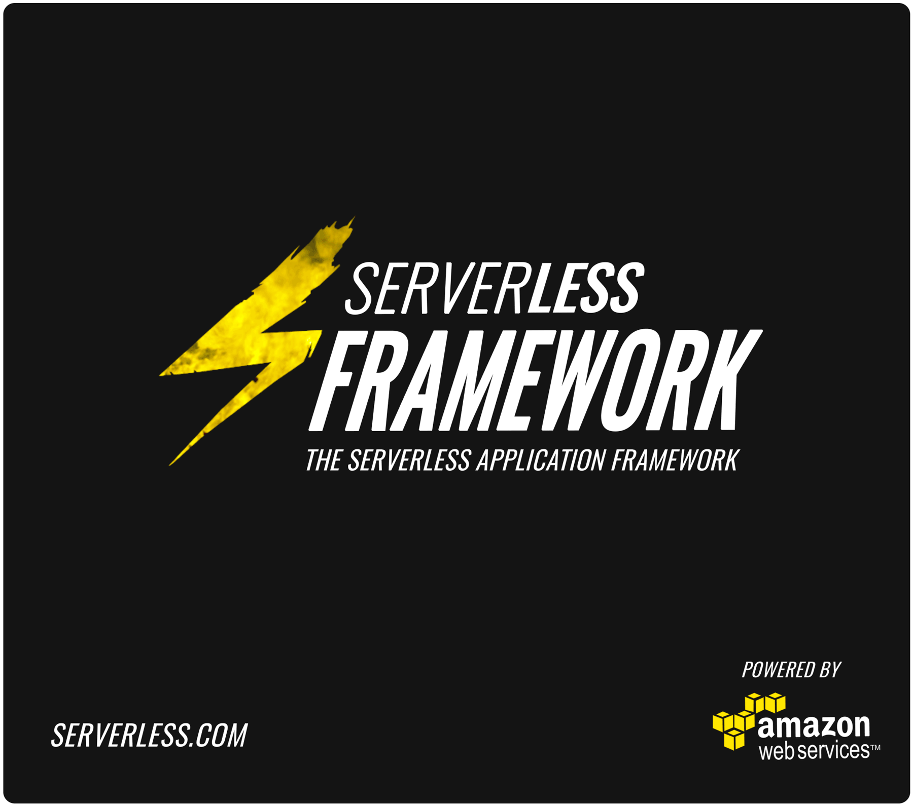

---

# :zap: serverless.com :zap:

framework for building
web, mobile and IoT applications **exclusively** on
AWS Lambda, API Gateway, and related services


---

# :thought_balloon:

---

## Vendor Lock-in :fearful:

^ Cons: obvious
Why would you do this?


---

# OPS


^ Relying on Amazon for Ops. They're better at it than you'll ever be.
If you disagree you should apply for an ops job at Amazon.

^ Especially true if you're an application developer and not an ops
specialist.

---

# Scale


---

# Money


^ Especially when compared to the cost of operations engineers,
deploying code to AWS can be very inexpensive.

---

<!--
# The Plan

* Understand the Pieces

* Serverless
-->

<!--
* Lambda
  * Functions
  * Pricing
  * GUI
* API Gateway
  * GUI
* CloudFront
  * GUI
* Serverless
  * Install
  * Project
  * Function / Endpoint
  * Deploy
  * Architectures
-->


# Jeremy Green

Consultant, Author, SaaSer


@jagthedrummer
jeremy@octolabs.com

---

IndependentConsultingManual.com

Remarq.io

CloudHdr.com

Things I Enjoy:
Dopamine, Serotonin

Other Interests:
Drumming, Photography, and Brewing

---


^ Thanks to click funnels for supporting this talk and
allowing me to talk about what we've been doing.

---


---

# The Pieces


---

# Lambda


^ Heroku for single functions
Raw compute power.

---

# API Gateway


^ URL routing as a service.
HTTP calls can be mapped to Lambda invocations.

---

# DynamoDB


---

# RDS


---

## CloudFormation


^ Infrastructure as code.

---

## Putting it all together

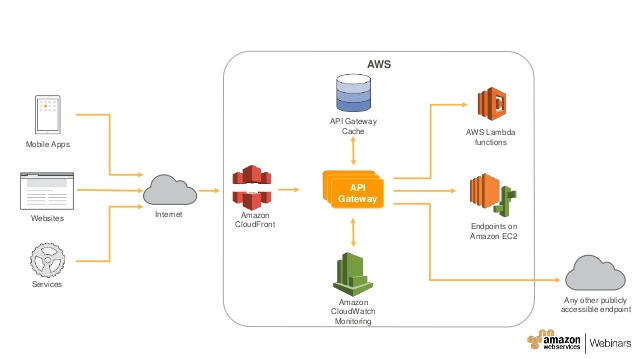


---

# Serverless

serverless.com

Manage Lambda, API Gateway and CloudFormation
via code and CLI instead of via GUI.

docs.serverless.com


---

# Getting started

---

## First step

* # Create a new AWS account!

* ## Srsly!

^ Serverless getting started instructions start with
very permissive permissions.

^ For production deployement in a 'live' account you 
should take time to understand the permission model.

---

```bash
$ npm install -g serverless
```

---

```bash
$ sls project create
```

---

```bash
 _______                             __
|   _   .-----.----.--.--.-----.----|  .-----.-----.-----.
|   |___|  -__|   _|  |  |  -__|   _|  |  -__|__ --|__ --|
|____   |_____|__|  \___/|_____|__| |__|_____|_____|_____|
|   |   |             The Serverless Application Framework
|       |                           serverless.com, v0.5.5
`-------'
```

---

```
Serverless: Initializing Serverless Project...  
Serverless: Enter a name for this project:  (serverless-bkqhpg) going-serverless-demo
Serverless: Enter a new stage name for this project:  (dev) 
Serverless: For the "dev" stage, do you want to use an existing Amazon Web Services
            profile or create a new one?
  > Existing Profile
    Create A New Profile
Serverless: Select a profile for your project: 
  > lambdatest
Serverless: Creating stage "dev"...  
Serverless: Select a new region for your stage: 
  > us-east-1
    us-west-2
    eu-west-1
    eu-central-1
    ap-northeast-1
Serverless: Creating region "us-east-1" in stage "dev"...  
Serverless: Deploying resources to stage "dev" in region "us-east-1" via Cloudformation
            (~3 minutes)...  
Serverless: /
```

---

```
Serverless: Successfully deployed "dev" resources to "us-east-1"  
Serverless: Successfully created region "us-east-1" within stage "dev"  
Serverless: Successfully created stage "dev"  
Serverless: Successfully initialized project "going-serverless-demo"
```

---

```bash
$ cd going-serverless-demo
$ tree
.
├── admin.env # AWS Profiles - gitignored
├── package.json # npm package file
├── s-project.json # project and author data
├── s-resources-cf.json # CloudFormation template
└── _meta # meta data for stage/regions config and variables - gitignored
    ├── resources
    │   └── s-resources-cf-dev-useast1.json
    └── variables
        ├── s-variables-common.json
        ├── s-variables-dev-useast1.json
        └── s-variables-dev.json

3 directories, 8 files
```

^ At this point the project is totally useless


---


# Lambda


^ Heroku for single functions

---

# Supported Runtimes

##Node
##JAVA
##Python\*

\*Python not suppored by Serverless**

**Yet

---


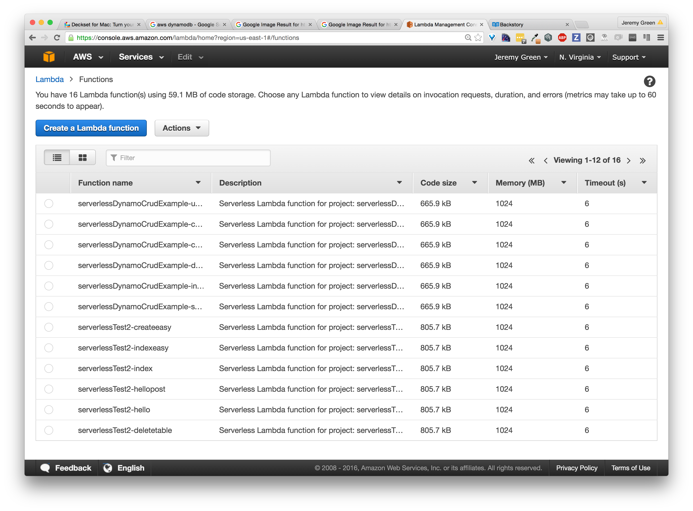

---

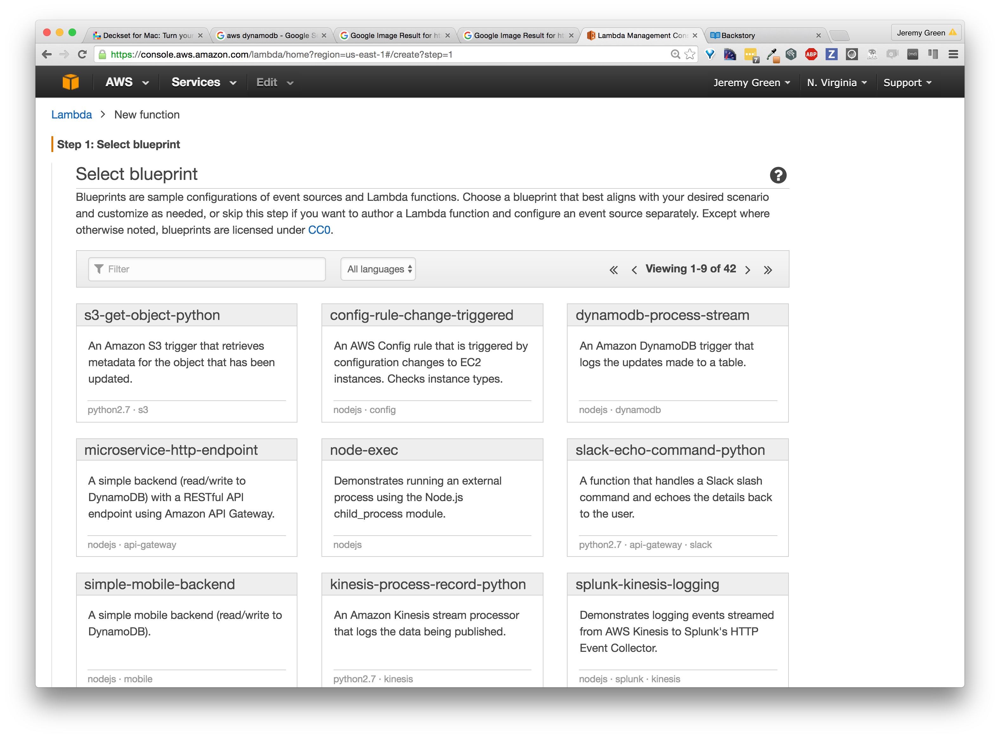

<!--
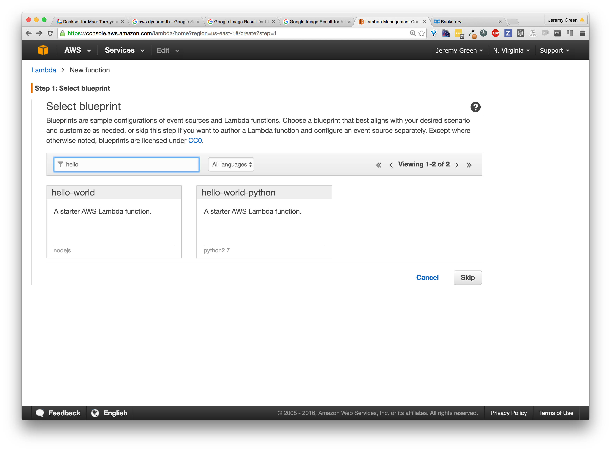
-->

---

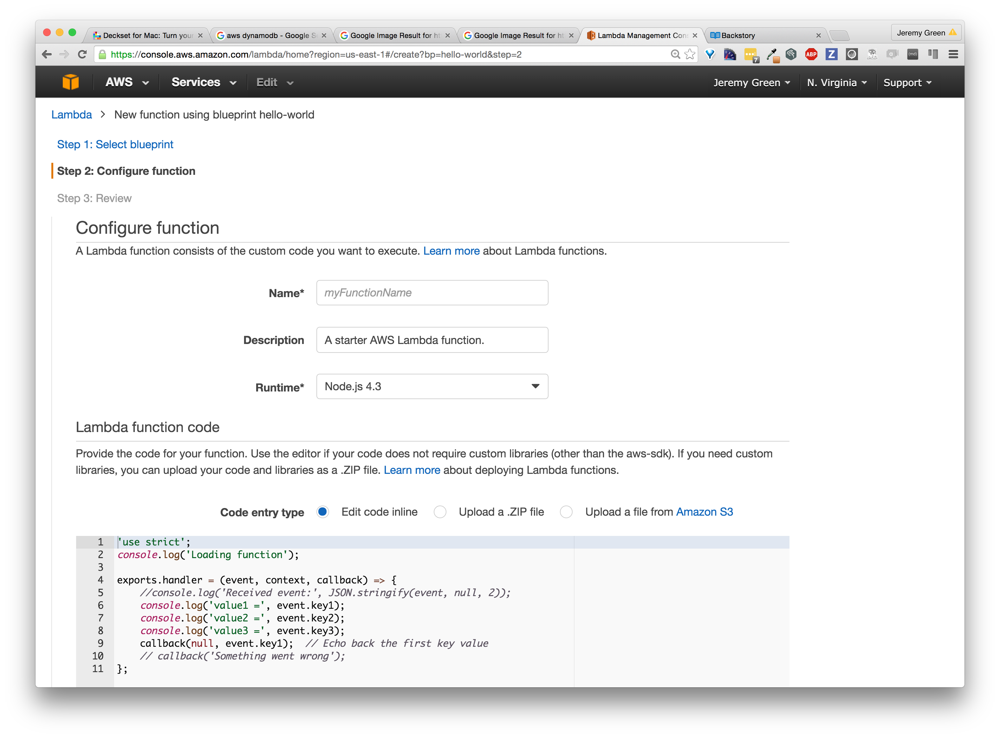

---

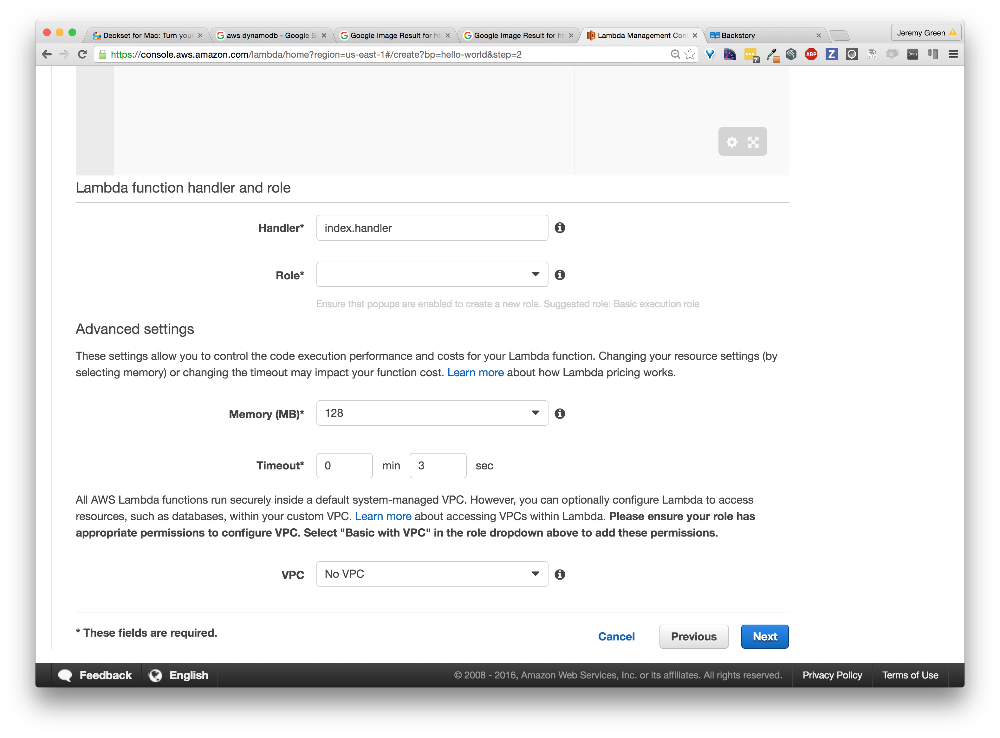

---

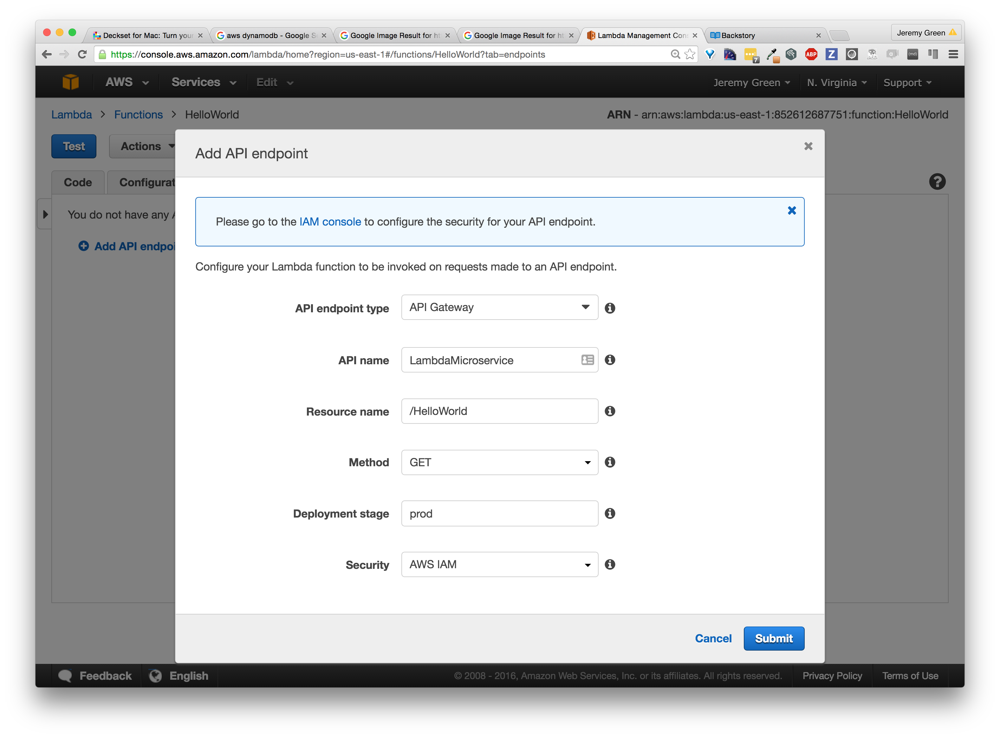

---


^ AWS IoT
^ Alexa Skills Kit
^ Alexa Smart Home
^ CloudWatch Events - Schedule
^ CloudWatch Logs
^ Cognito Sync Trigger
^ DynamoDB

---

<!--

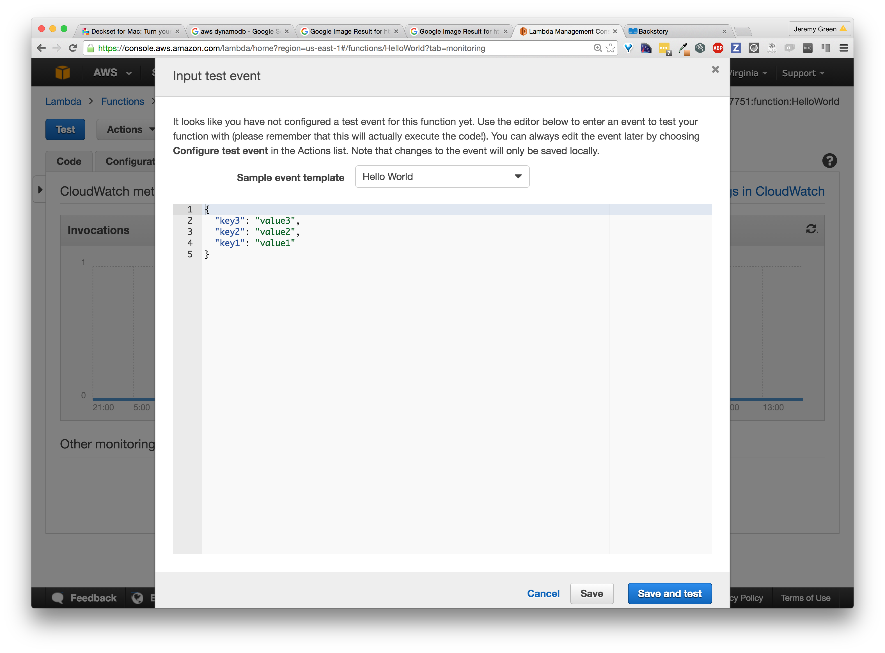

- - -

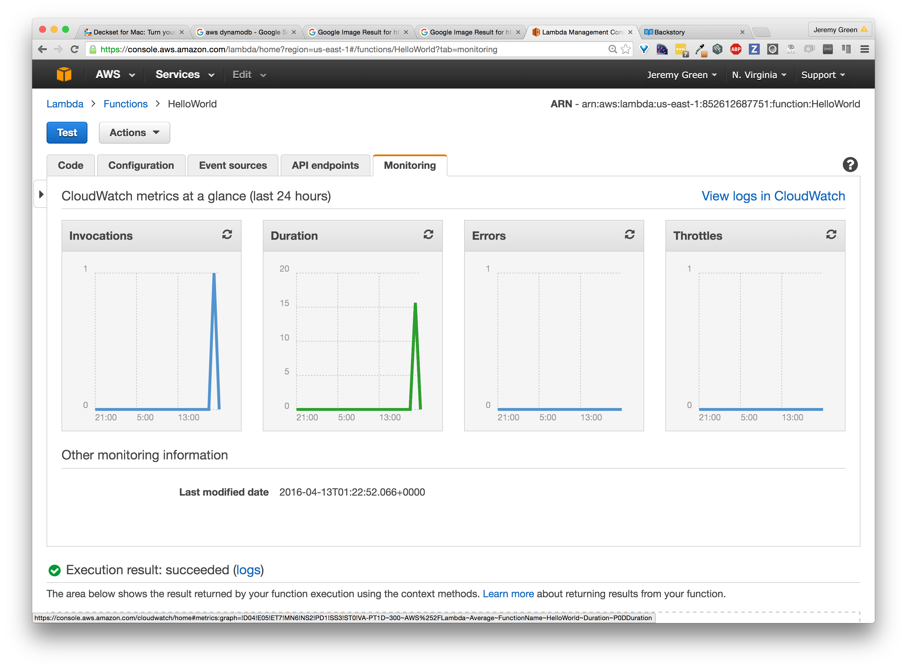

- - -

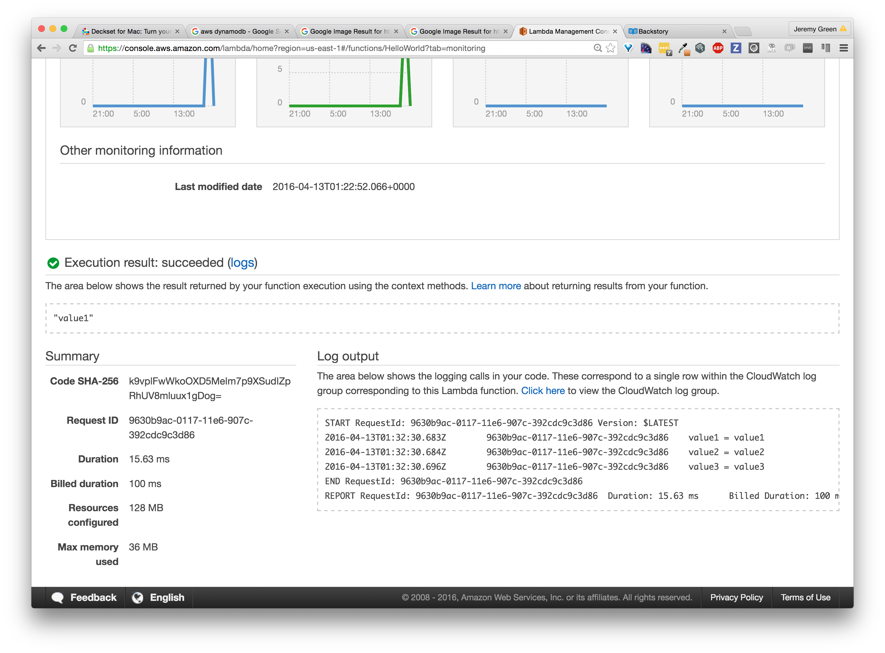

- - -

-->


# Coding in the browser?

---

# :unamused: → :fearful: → :rage:

---

# Serverless to the rescue

```
$ sls function create
```

---

```
$ sls function create
Serverless: Enter a new function name to be created in the CWD:  hello-world
Serverless: Please, select a runtime for this new Function
  > nodejs4.3
    python2.7
    nodejs (v0.10, soon to be deprecated)
Serverless: For this new Function, would you like to create an Endpoint, Event, or just the Function?
  > Create Endpoint
    Create Event
    Just the Function...
Serverless: Successfully created function: "hello-world"
```

---

```bash
$ tree hello-world/
hello-world/
├── event.json # sample event for testing function locally
├── handler.js # function handler
└── s-function.json # data for your lambda function, endpoints and event sources

0 directories, 3 files
```

---

# :ship: it!

---

```
$ sls dash deploy
```

---

```
$ sls dash deploy
 _______                             __
|   _   .-----.----.--.--.-----.----|  .-----.-----.-----.
|   |___|  -__|   _|  |  |  -__|   _|  |  -__|__ --|__ --|
|____   |_____|__|  \___/|_____|__| |__|_____|_____|_____|
|   |   |             The Serverless Application Framework
|       |                           serverless.com, v0.5.5
`-------'

Serverless: Select the assets you wish to deploy:
    hello-world
    *  function - hello-world
    *  endpoint - hello-world - GET
    - - - - -
  > Deploy
    Cancel
```

---

```
Serverless: Deploying the specified functions in "dev" to the following regions: us-east-1  
Serverless: ------------------------  
Serverless: Successfully deployed the following functions in "dev" to the following regions:   
Serverless: us-east-1 ------------------------  
Serverless:   hello-world (going-serverless-demo-hello-world):
  arn:aws:lambda:us-east-1:852612687751:function:going-serverless-demo-hello-world:dev  

Serverless: Deploying endpoints in "dev" to the following regions: us-east-1  
Serverless: Successfully deployed endpoints in "dev" to the following regions:  
Serverless: us-east-1 ------------------------  
Serverless:   GET - hello-world -
  https://yvgrg7f444.execute-api.us-east-1.amazonaws.com/dev/hello-world 
```

---

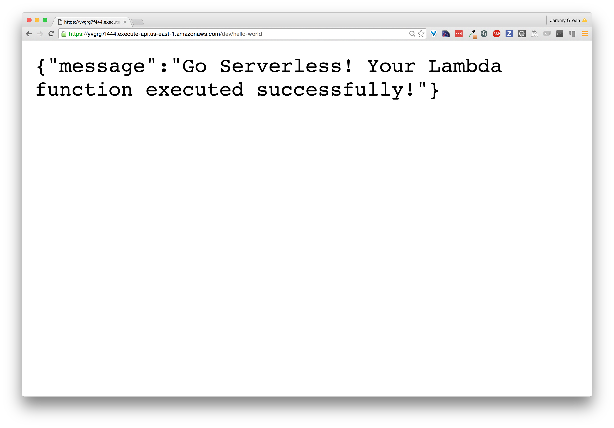


---

# Anatomy of a Lambda Function


---

```javascript
'use strict';
module.exports.handler = (event, context, callback) => {
    console.log('value1 =', event.key1);
    console.log('value2 =', event.key2);
    callback(null, event.key1);  // Echo back the first key value
    // callback('Something went wrong');
};
```

^ Your handler can be named whatever you want.
You configure it during Lambda setup.

^ Referenced by filename dot function name.

^ Maybe index.handler

---

# `event`

used to pass data to the function

```json
{
  key1: 'value1',
  key2: 'value2',
  key3: 'value3'
}
```

---

# `context`

provides runtime information

```javascript
{
  getRemainingTimeInMillis: function(){},
  functionName:             'handler',
  functionVersion:          'xyz',
  awsRequestId:             '12345',
  logGroupName:             'abcde',
  identity:                 {...},
  clientContext:            {...}
}
```

---

# `callback`

used to return data or an error

```javascript
// signature
callback(error,data);
// call with error
callback("some error message");
//or call with data
callback(null, someData);
```

---

# Let's build something real

---

# LPaaS

## left-pad as a service*

\* OK, "real" :smiling_imp:

---

```
$ sls function create left-pad
...
$ cd left-pad

$ npm init
...
$ npm install left-pad --save
```

---

# left-pad/handler.js

```javascript
'use strict';

let leftpad = require('left-pad');

module.exports.handler = function(event, context, cb) {
  var string = event.string || "",
      padding = event.padding || 0,
      paddedString = leftpad(string,padding),
      payload = { paddedString };
  return cb(null, payload);
};
```

---

# left-pad/s-function.json (simplified)

```javascript
{
  "runtime": "nodejs4.3",
  "handler": "handler.handler",
  "memorySize": 1024
  "endpoints": [
    {
      "path": "left-pad",
      "method": "GET",
      "requestTemplates": {
        "application/json": {
          "string":  "$input.params('string')",
          "padding": "$input.params('padding')"
        }
      }
    }
  ]
}
```

---

```
$ sls dash deploy
...
Serverless:   GET - left-pad -
  https://yvgrg7f444.execute-api.us-east-1.amazonaws.com/dev/left-pad
```

---

https://yvgrg7f444.execute-api.us-east-1.amazonaws.com/dev/left-pad?string=test&padding=10

```
{
  "paddedString":"      test"
}
```


<!--

### `hello-world/handler.js`

```javascript
'use strict';

module.exports.handler = function(event, context, cb) {
  return cb(null, {
    message: 'Go Serverless! Your Lambda function executed successfully!'
  });
};
```

---

### `hello-world/s-function.json`

```javascript
{
  "name": "hello-world",
  "runtime": "nodejs4.3",
  "description": "Serverless Lambda function for project: going-serverless-demo",
  "customName": false,
  "customRole": false,
  "handler": "handler.handler",
  "timeout": 6,
  "memorySize": 1024,
  "authorizer": {},
  "custom": {
    "excludePatterns": []
  },
  "endpoints": [...],
  "events": [],
  "environment": {
    "SERVERLESS_PROJECT": "${project}",
    "SERVERLESS_STAGE": "${stage}",
    "SERVERLESS_REGION": "${region}"
  },
  "vpc": {
    "securityGroupIds": [],
    "subnetIds": []
  }
}
```

---
### `hello-world/s-function.json`

```javascript
{
  "endpoints": [
    {
      "path": "hello-world",
      "method": "GET",
      "type": "AWS",
      "authorizationType": "none",
      "authorizerFunction": false,
      "apiKeyRequired": false,
      "requestParameters": {},
      "requestTemplates": { ... },
      "responses": {
        "400": { "statusCode": "400" },
        "default": {
          "statusCode": "200",
          "responseParameters": {},
          "responseModels": { ... },
          "responseTemplates": { ... }
        }
      }
    }
  ]
}
```
-->

---


# Possible Architectures

* Monolithic
* Microservices
* Nanoservices

---

# Lambda Lifecycle

# :arrows_counterclockwise:

1. You upload your code

2. Amazon doesn't do anything

---

# Lambda Cold Start :snowflake:

1. AWS Receives Execution Request

2. Container is provisioned

3. Container is loaded with your code

4. Your code begins execution

5. Your code returns a result

---

# Time Passes

# :clock1:

## (But not too much)

---

# Lambda Container Reuse :recycle:

1. AWS Receives Execution Request

2. Your code begins execution

3. Your code returns a result


---

<!--

## Lambda Pricing :moneybag:

Charged by:

* \# of requests

* length of execution

---

## Lambda Request Pricing

First 1 million requests per month are free

$0.20 per 1 million requests thereafter<br/>($0.0000002 per request)

---

## Lambda Execution Pricing

First 400,000 GB-seconds per month are free

$0.00001667 for per GB-second thereafter

---

GB-second 

 =

LambdaMemoryInGigabytes * ExecutionTime

<hr/>

1GB * 1sec = 1 GB-sec
0.5GB * 2sec = 1 GB-sec
0.1GB * 0.5sec * 20executions = 1 GB-sec

---

## Lambda Pricing Example

3 million executions per month

512MB of memory

1 second execution time

$18.74 per month

---

## Lambda Pricing Example

3 million executions per month

512MB of memory

**0.5 second execution time**

$6.24 per month

---

## Lambda Pricing Example

3 million executions per month

512MB of memory

**0.2 second execution time**

$0.40 per month

---

-->


<!--
## API Gateway


---

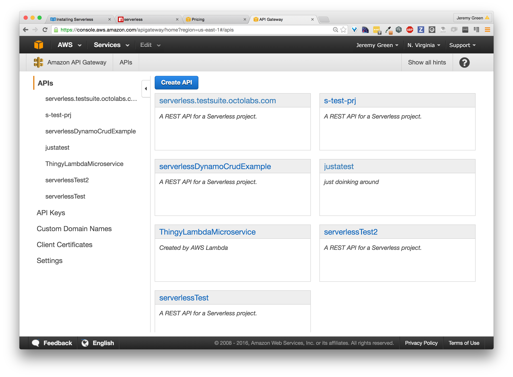

---

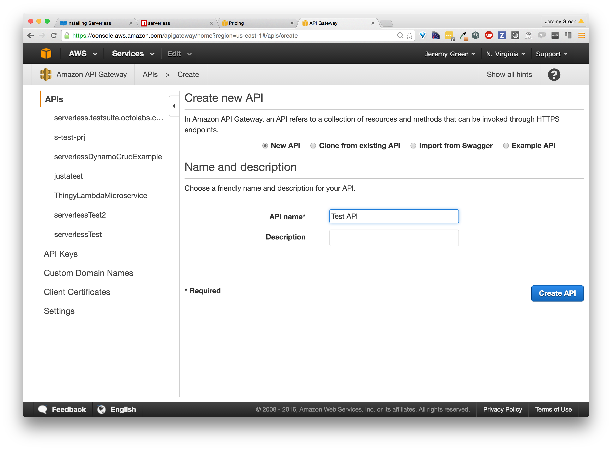

---

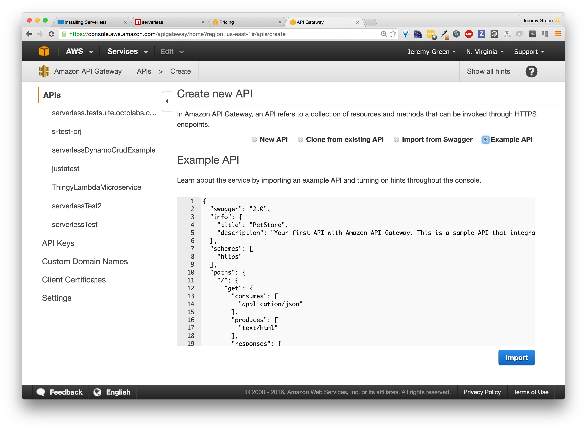

---

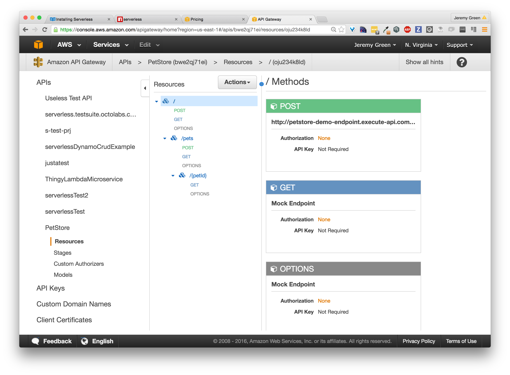

---

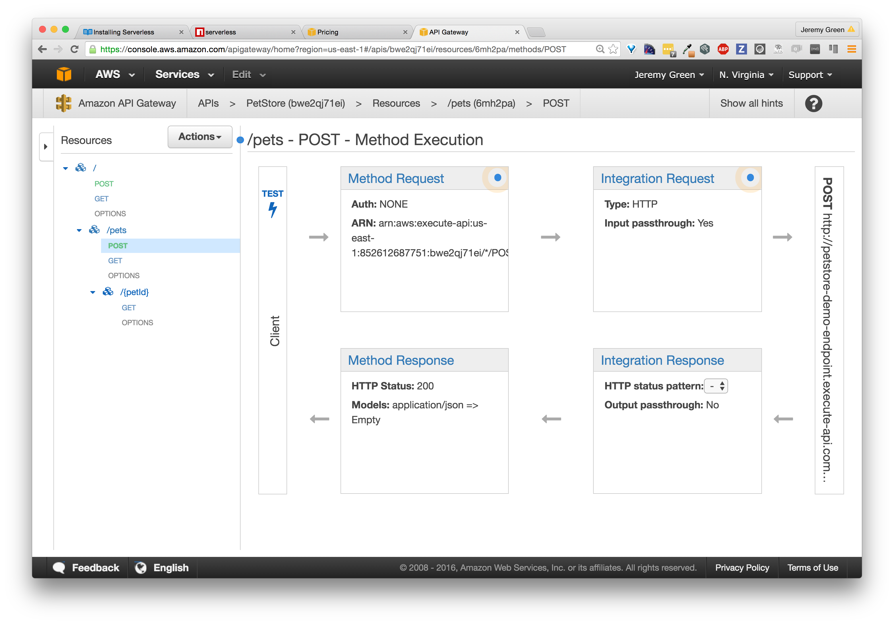

---
-->

<!-- 
# Swagger

swagger.io

Used to describe and document RESTful APIs

---


```json
{
  "swagger": "2.0",
  "info": {
    "title": "PetStore",
    "description": "A simple Pet Store Demo"
  },
  "schemes": [ "https" ],
  "paths": {
    "/": {
      "get": {...},
      "post": {...},
      "options": {...}
    },
    "/pets": {...},
    "/pets/{petId}": {...}
  }
}
```

---

-->

<!--

## CloudFormation


---

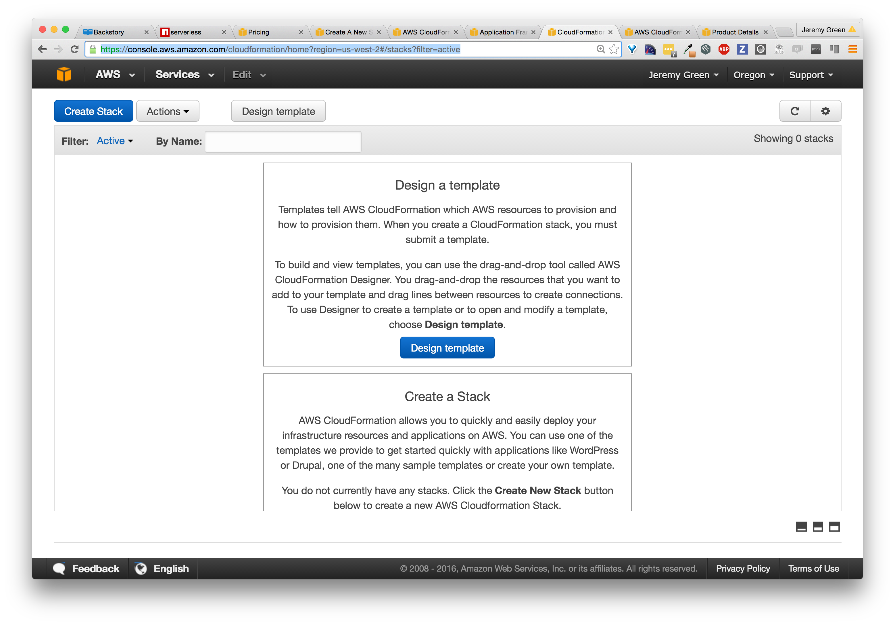

---

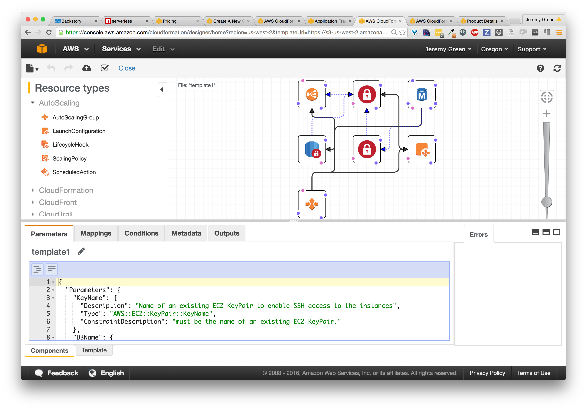

---

```json
{
  "AWSTemplateFormatVersion": "2010-09-09",
  "Description": "Simple Rails & local Mysql stack",
  "Parameters": {
    "KeyName": {
      "Description": "Name of an existing EC2 KeyPair to enable SSH access to the instances",
      "Type": "AWS::EC2::KeyPair::KeyName",
      "ConstraintDescription": "must be the name of an existing EC2 KeyPair."
    },
    "DBName": { ... },
    "DBUser": { ... },
    "DBPassword": { ... },
    "DBRootPassword": { ... },
    "InstanceType": { ... },
    "SSHLocation": { ... }
  },
  "Resources": {
    "WebServer": { ... },
    "WebServerSecurityGroup": { ... }
  },
  "Outputs": {
    "WebsiteURL": { ... }
  },
  ...
}
```

---

-->


## Monolithic Architecture

* A single Lambda
handles multiple concerns

* Multiple API Gateway
endpoints map to one Lambda

* Cold start will be slow

<!--
* Any interaction with the
system keeps Lambda alive
-->

---

# Monolithic Lambda

```
MyGiantLambda
  ├── Users
  └── Posts
```

```
module.exports.usersIndex  = function(...){...}
module.exports.usersCreate = function(...){...}
module.exports.postsIndex  = function(...){...}
module.exports.postsCreate = function(...){...}
```

---

# Monolithic API Gateway

```
GET /users
  └── MyGiantLambda.usersIndex

POST /users
  └── MyGiantLambda.usersCreate

POST /posts
  └── MyGiantLambda.postsCreate
```

<!--
/users[/*]
  └── MyGiantLambda.Users.[index|show|create|update|delete]

/posts[/*]
  └── MyGiantLambda.Posts.[index|show|create|update|delete]

/comments[/*]
  └── MyGiantLambda.Comments.[index|show|create|update|delete]
-->

---

# Microservices Architecture

* A single Lambda function for each concern/resource

* Multiple API Gateway enpoints map
to multiple Lambdas

* Cold start not as slow

<!--
* Any interaction with a concern
keeps that concern alive
-->

---

# Microservices Lambda

```
UserLambda
  └── Users
module.exports.index  = function(...){...}
module.exports.create = function(...){...}

PostLambda
  └── Posts
module.exports.index  = function(...){...}
module.exports.create = function(...){...}
```

---

# Microservices API Gateway

```
GET /users
  └── UserLambda.index

POST /users
  └── UserLambda.create

POST /posts
  └── PostLambda.create
```
<!--
/users[/*]
  └── UserLambda.[index|show|create|update|delete]

/posts[/*]
  └── PostLambda.[index|show|create|update|delete]

/comments[/*]
  └── CommentLambda.[index|show|create|update|delete]
-->

---

# Nanoservices Architecture

* A single Lambda function
for each logical function

* One-to-one mapping between
API Gateway & Lambda

* Fastest cold start

<!--
* Each function has a separate lifecycle
-->

---

# Nanoservices Lambda

```
UserIndexLambda
  └── handler

UserCreateLambda
  └── handler

PostIndexLambda
  └── handler

PostCreateLambda
  └── handler
```

---

# Nanoservices API Gateway

```
GET /users
  └── UserIndexLambda.handler

POST /users
  └── UserCreateLambda.handler

POST /posts
  └── PostCreateLambda.handler
```

---

# Wrapping Up

---

## AWS Provides the Building Blocks

---

## Serverless Provides Structure and Process

---

## You provide the


---

.
 
# Thank you!

octolabs.com/goingserverless-okcjs


