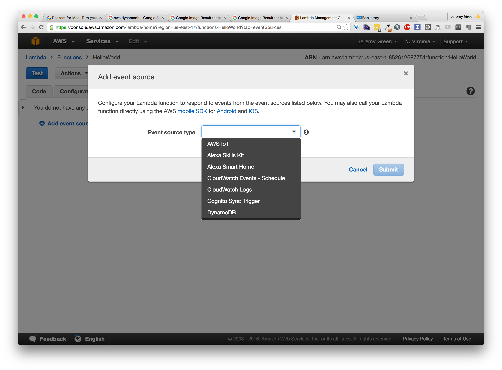

autoscale: true
footer: *@jagthedrummer - OctoLabs.com*
slidenumbers: false

# Going Serverless

^ Deploying web apps without servers.


---

# Serverless?


---

# Serverless


^ Yes, there are servers, but you and your code don't have
to know about them.

^ In general it's a programming/deployment model where you
don't worry about the infrastructure running your code.

---

## serverless.com

framework for building
web, mobile and IoT applications on
AWS Lambda, API Gateway, and related services


---

## Vendor Lock-in

^ Cons: obvious
Why would you do this?


---

# OPS


^ Relying on Amazon for Ops. They're better at it than you'll ever be.
If you disagree you should apply for an ops job at Amazon.

^ Especially true if you're an application developer and not an ops
specialist.

---

# Scale


---

# Money


^ Especially when compared to the cost of operations engineers,
deploying code to AWS can be very inexpensive.

---

# The Pieces


---

# Lambda


^ Heroku for single functions
Raw compute power .

---

# API Gateway


^ URL routing as a service.
HTTP calls can be mapped to Lambda invocations.

---

# DynamoDB


---

# RDS


---

## CloudFormation


^ Infrastructure as code.

---

# Jeremy Green

Consultant, Author, SaaSer


@jagthedrummer
jeremy@octolabs.com

---

IndependentConsultingManual.com

Remarq.io

CloudHdr.com

Things I Enjoy : Dopamine, Serotonin

Other Interests : Drumming, Photography, and Brewing

---

# Lambda


^ Heroku for single functions

---

# Supported Runtimes

Node
JAVA
Python

---

# Anatomy of a Lambda Function


---

```javascript
'use strict';
exports.myHandler = (event, context, callback) => {
    console.log('value1 =', event.key1);
    console.log('value2 =', event.key2);
    callback(null, event.key1);  // Echo back the first key value
    // callback('Something went wrong');
};
```

^ you must define `exports.myHandler`

---

# `event`

used to pass data to the function

---

# `context`

provides runtime information

---

# `callback`

used to return data or an error

```javascript
// signature
callback(error,data);
// call with error
callback("some error message");
//or call with data
callback(null, someData);
```

---


## Lambda Pricing

Charged by:

\# of requests

length of execution

---

## Lambda Request Pricing

First 1 million requests per month are free

$0.20 per 1 million requests thereafter<br/>($0.0000002 per request)

---

## Lambda Excecution Pricing

First 400,000 GB-seconds per month are free

$0.00001667 for per GB-second thereafter

---

## Lambda Pricing Example

3 million executions per month

512MB of memory

1 second execution time

$18.74 per month

---

## Lambda Pricing Example

3 million executions per month

512MB of memory

**0.5 second execution time**

$6.24 per month

---

## Lambda Pricing Example

3 million executions per month

512MB of memory

**0.2 second execution time**

$0.40 per month

---


---


---


---


---


---



^ AWS IoT
^ Alexa Skills Kit
^ Alexa Smart Home
^ CloudWatch Events - Schedule
^ CloudWatch Logs
^ Cognito Sync Trigger
^ DynamoDB

---


---


---


---


---


## API Gateway


---


---


---


---


---


---

# Swagger

swagger.io

Used to describe and document RESTful APIs

---


```json
{
  "swagger": "2.0",
  "info": {
    "title": "PetStore",
    "description": "A simple Pet Store Demo"
  },
  "schemes": [ "https" ],
  "paths": {
    "/": {
      "get": {...},
      "post": {...},
      "options": {...}
    },
    "/pets": {...},
    "/pets/{petId}": {...}
  }
}
```

---

## CloudFormation


---


---


---

```json
{
  "AWSTemplateFormatVersion": "2010-09-09",
  "Description": "Simple Rails & local Mysql stack",
  "Parameters": {
    "KeyName": {
      "Description": "Name of an existing EC2 KeyPair to enable SSH access to the instances",
      "Type": "AWS::EC2::KeyPair::KeyName",
      "ConstraintDescription": "must be the name of an existing EC2 KeyPair."
    },
    "DBName": { ... },
    "DBUser": { ... },
    "DBPassword": { ... },
    "DBRootPassword": { ... },
    "InstanceType": { ... },
    "SSHLocation": { ... }
  },
  "Resources": {
    "WebServer": { ... },
    "WebServerSecurityGroup": { ... }
  },
  "Outputs": {
    "WebsiteURL": { ... }
  },
  ...
}
```

---

# Serverless

serverless.com

Manage Lambda, API Gateway and CloudFormation
via code instead of via GUI.


---

```bash
npm install -g serverless
```

